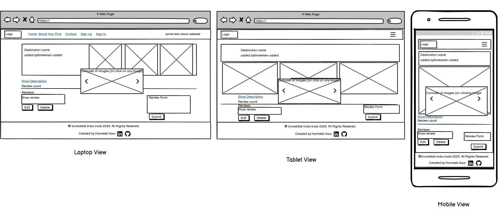

# Incredible-India-Trails

## Overview
Incredible India Trails is a web application designed to showcase the beauty and diversity of travel destinations across India. The platform allows users to explore various destinations, read reviews, and share their own travel experiences. It provides full CRUD functionality, enabling users to create, read, update, and delete Reviews efficiently. The primary goal of the project is to provide a comprehensive and user-friendly platform for travelers to discover new places, share their adventures and experiences  with others.

## UX Design Process
- **Link to User Stories in GitHub Projects:**
  - A project board was set-up to keep track of user stories. Each user story was assigned a 'MoSCoW' prioritisation (must have, should have, could have, won't have) tag. The board can be found
  - [\[Link to the GitHub Projects kanban board.\]](https://github.com/users/Harmeetkaur13/projects/15)
- **Wireframes:**
  - Home Page
  - 
  - View Destinaion Page
  - 
- **Design Rationale:**
  - The layout emphasises simplicity and readability, with Bootstrap 5 providing a responsive design. The colour scheme adheres to WCAG guidelines for contrast, and the typography uses accessible fonts for clarity.
  - Accessibility considerations include keyboard navigation and screen reader support, ensuring usability for users with diverse needs.
- **Reasoning For Any Final Changes:**
  - Added the collapse option for the description on view destination page. The reason behind this ws on mobile screens this was affecting the performace on lighthouse  due to its large layout.
  - This change really enhanced the performance.

## Key Features
1. Admin Interface:
- Description: Admins have a customized interface to manage destinations, reviews, and user feedback.
- Value: Simplifies the management of content and user interactions on the platform.

2. Search and Filter:
- Description: Users can search for destinations and filter them by categories.
- Value: Makes it easy for users to find specific destinations based on their preferences.

3. User Authentication:
- Description: Users can sign up, log in, and log out securely.
- Value: Ensures that only registered users can add reviews and destinations, enhancing security and user accountability.

4. Review System:
- Description: Users can leave reviews for destinations, including ratings and comments.
- Value: Allows users to share their experiences and helps others make informed decisions.

5. Image Carousel:
- Description: Each destination page features an image carousel to showcase multiple images.
- Value: Enhances the visual appeal and provides a better user experience by displaying multiple images.

6. Contact Form:
- Description: Users can submit feedback or inquiries through a contact form.
- Value: Provides a way for users to communicate with the site administrators.

7. Add Destination:
- Description: Users can add destination they know through 'Share your Find' link.
- Value: Provides a way for logged-in users to share the places they know with everyone.

- Inclusivity Notes:
  - Features include ARIA labels, inert and alt attributes on images for screen readers.

## Deployment
- **Platform:**  : Heroku
- **High-Level Deployment Steps:** 
  * Heroku is a cloud platform that lets developers create, deploy, monitor and manage apps.
- You will need a Heroku log-in to be able to deploy a website to Heroku.
- Once you have logged into Heroku:
1. Click 'New' > 'Create new app'
2. Choose a unique name, choose your region and press 'Create app'
3. Click on 'Settings' and then 'Reveal Config Vars'
4. Add a key of 'DISABLE_COLLECTSTATIC' with a value of '1'.
5. Add a key of 'DATABASE_URL' - the value will be the URL you were emailed when creating your database.
6. Add a key of 'SECRET_KEY' - the value will be any random secret key 
7. In your terminal, type the code you will need to install project requirements:
* pip3 install gunicorn~=20.1
* pip3 install -r requirements.txt
* pip3 freeze --local > requirements.txt
8. Create an 'env.py' file at the root directory which contains the following:
    - import os
    - os.environ["DATABASE_URL"]='CI database URL'
    - os.environ["SECRET_KEY"]="Your secret key"
    - os.environ["CLOUDINARY_URL"]= "Your CLOUDINARY_URL"
  * add: ?secure=true  at the end of CLOUDINARY_URL to Force Cloudinary Images to Use HTTPS in Django

8. Create a file at the root directory called Procfile. In this file enter: 
* "web: gunicorn my_project.wsgi" (without the quotes)
9. In settings.py, set DEBUG to False. 
* YOU SHOULD ALWAYS SET DEBUG TO FALSE BEFORE DEPLOYING FOR SECURITY
10. Add ",'.herokuapp.com' " (without the double quotes) to the ALLOWED_HOSTS list in settings.py
11. Add, commit and push your code.
12. Go back to Heroku, click on the 'Deploy' tab.
13. Connect your project to GitHub.
14. Scroll to the bottom and click 'Deploy Branch' and your project will be deployed!
- **Verification and Validation:**
  - Tested the deployed application against the development environment for consistent functionality and design.
  - Verified accessibility using tools such as Lighthouse and manual testing.
- **Security Measures:**
  - Sensitive data is stored in environment variables.
  - Secret keys and all sensitive data is saved directly to Config Vars in Heroku.
  - DEBUG mode is disabled in the production environment to enhance security.

## AI Implementation and Orchestration

### Use Cases and Reflections:
Throughout the development of the **Incredible India Trails** project, I made extensive use of AI tools, particularly Copilot and ChatGPT, to streamline development and testing. This was my first time integrating AI this deeply into a project, and it turned out to be an incredibly helpful collaborator throughout the process.

  - **Code Creation:** 
    - Reflection: At first, I was uncertain about how much I could rely on AI for generating critical parts of the code, but I soon recognized its ability to quickly generate Django models, views, and even HTML structures. Using reverse prompts and multi-step interactions gave me the flexibility to experiment with different solutions and refine the code to fit the project’s goals. AI suggested ways to optimize database queries and improve code readability, which saved significant time and enhanced the final result.
     - Highlight: The back-and-forth collaboration with AI felt like working with an experienced pair programmer. The clearer I made my prompts, the more accurate and useful the results were, allowing me to focus on higher-level tasks while AI handled repetitive tasks efficiently.
    - Examples: 
      - Generated Django models for destinations, user reviews, and superuser approval workflows.
      - Created views and URL patterns to handle user authentication and CRUD operations.
      - Assisted in structuring HTML templates using Bootstrap for responsive design.
      - Assisted to ensure all fields in the DestinationForm and ImageForm were required and added custom validation to the form.
  
  - **Debugging & Error Resolution:** 
    - Reflection: Debugging with AI was a learning experience. The tool didn’t just spot errors; it often provided insightful suggestions that helped me rethink the structure of my code. For example, I was able to simplify some of the logic, making it more accessible to others who might work on the project in the future. This process also helped me improve my problem-solving skills by encouraging me to think about different ways to approach issues.
    - Examples:
      - Fixed issues with user authentication and permissions (ensuring superusers can approve reviews).
      - EnsuredFixed the issue of Pop-Up not showing by assisting to ensure the messages(PopUp) framework was set up correctly, updated the template to include the necessary elements for displaying the pop-up message, and verified the JavaScript code for displaying and closing the pop-up.

  - **Performance and UX Optimization:** 
    - Reflection: A standout moment in the project was when I used AI to improve the UI responsiveness and overall performance. I’m not particularly confident in front-end design, but AI offered helpful suggestions on improving the Bootstrap layout, such as optimizing image loading and refining button placements. These small changes had a big impact, ensuring the website was responsive across devices without sacrificing performance.

  - Highlight: I particularly appreciated how AI encouraged me to think about mobile-first design and user accessibility, making it a more inclusive and user-friendly experience. These insights helped the project feel polished and professional.
    - Examples:
      - Optimized PostgreSQL queries for retrieving and sorting large datasets.
      - Recommended Bootstrap-based enhancements for a better mobile-friendly UI.
      - Provided insights on lazy loading images to improve site performance.
      - Suggested to remove the aria-hidden attribute and used the inert attribute instead, updating the JavaScript code to handle the inert attribute when showing and hiding the modal.

- **Overall Impact:**
  - AI tools streamlined repetitive tasks, enabling focus on high-level development.
  - Efficiency gains included faster debugging, comprehensive testing, and improved code quality.
  - Challenges included contextual adjustments to AI-generated outputs, which were resolved effectively, enhancing inclusivity.

  Working with AI had a transformative effect on my development process. It allowed me to focus on more complex aspects of the project while it handled repetitive and time-consuming tasks. That said, not all suggestions were perfect—some required fine-tuning to better fit the project’s context. These moments served as valuable reminders that AI is not a replacement for my skills but a tool that enhances them.
  Reflecting on the experience, I feel that my technical abilities have improved significantly. I’ve become more efficient in debugging, testing, and implementing features. Moreover, I’ve learned how to use AI to enhance inclusivity and accessibility in software development. Above all, this experience taught me the importance of viewing new technologies as collaborators in the creative process.

## Testing 
- **Manual Testing:**
- Please see [TESTING.md](TESTING.md) file for all testing.

### Cloning
- To clone a GitHub repository:
1. On GitHub.com, navigate to [the repository you want to clone.](https://github.com/Harmeetkaur13/Incredible-India-Trails)
2. Click the "Code" button (found above the list of files).
3. Copy the URL for the repository.
4. Open Git Bash or your chosen terminal.
5. Navigate to the directory where you want to clone the repository.
6. Type: git clone https://github.com/Harmeetkaur13/Incredible-India-Trails.git
7. Press Enter to create your local clone.

## Future Enhancements
- To improve performance, in the future I will render only 2 or 3 destination cards on the Home page for small screens.
- For better UX, I will reduce the area taken up by the "added by" and "location" rows and use a different way to display them so that the main focus is on the destination images (carousel).
- For further support to willing visitors, I want to add links so they can see the prices of tours to the destination.
- For visitors, I want to provide travel and accommodation booking facilities so they can easily plan a trip to their dream destination.
- On the basis of feedback from user, if there is any issue regarding UX design or Accessibility, I would love to enhance the website accordingly.

## Credits
- AI Copilot and ChatGPT for helping me throughout my project.
- Our Facilitator, Emma Lamont, for being helpful like always, encouraging at every single step, and concerned about our health during the project. Especially for providing responsive screenshots, walkthroughs, and useful feedback.
- Coding coaches Roo and Spencer for solving issues during development.
- Charles Tach for the impressive feedback that really helped me improve the website.