# Testing

- Manual testing was carried out throughout the development of the website and bugs fixed as they arose. 

## Manual testing
- Manual testing was carried out on the local and deployed sites.

| Location           | Feature                 | Expected Outcome                                                                                                                                 | Pass/Fail | Notes                                                                                 |
| ------------------ | ----------------------- | ----------------------------------------------------------------------------------------------------------------------------------------------- | --------- | ------------------------------------------------------------------------------------- |
| Header             | Home button             | Takes user to home page on click                                                                                                                | PASS      |                                                                                       |
| Header             | Share Your Find         | Takes user to Share Your Find page on click                                                                                                     | PASS      |                                                                                       |
| Header             | Share Your Home         | If user is not logged in, they see the option to sign in on the page. Only after signing in, they can add a destination                          | PASS      |                                                                                       |
| Header             | Contact                 | Takes user to Contact page on click                                                                                                             | PASS      |                                                                                       |
| Header             | Sign-in button          | Takes user to Sign In page on click                                                                                                             | PASS      | If user is not logged in, the Sign Up and Sign In buttons will be displayed.          |
|                    |                         |                                                                                                                                                 |           | If logged in, only the Sign Out button appears.                                       |
| Header             | Sign Up button          | Takes user to Sign Up page on click                                                                                                             | PASS      |                                                                                       |
| Header             | Sign Out button         | Takes user to Sign Out page on click                                                                                                            | PASS      |                                                                                       |
| Sign In page       | Sign In function        | When user enters an unknown username, the user will not be logged in                                                                            | PASS      |                                                                                       |
| Sign In page       | Log-in function         | When user enters an unknown password, the user will not be logged in                                                                            | PASS      |                                                                                       |
| Sign In page       | Sign In function        | When user enters a known username AND password, the user will be logged in                                                                      | PASS      |                                                                                       |
| Sign Up page       | Sign Up function        | If user does not enter information into any of the fields, they will be prompted to fill in the field                                           | PASS      |                                                                                       |
| Sign Up page       | Sign Up function        | If user does not enter a password that fits the criteria, they will not be registered                                                           | PASS      |                                                                                       |
| Sign Up page       | Sign Up function        | If user does not enter a matching password into the password (again) box, they cannot create an account                                         | PASS      |                                                                                       |
| Sign Up page       | Sign Up function        | If user enters appropriate details, they will be registered                                                                                     | PASS      |                                                                                       |
| Sign Out page      | Sign Out button         | Signs user out on click                                                                                                                         | PASS      |                                                                                       |
| Home page          | Next button             | If there are more than six destinations, a 'Next >>' button will appear. On click, this will load the next six available destinations.           | PASS      |                                                                                       |
| Home page          | Prev button             | On clicking Next >>, it will load the next six available destinations. On this page, a '<< Prev' button will appear.                            | PASS      | On click, this will load the previous six destinations.                               |
| Footer             | LinkedIn icon           | Clicking will take you to the LinkedIn account of the creator.                                                                                  | PASS      |                                                                                       |
| Footer             | GitHub icon             | Clicking will take you to the GitHub source of code on the account of the creator.                                                              | PASS      |                                                                                       |
| Review             | Leave a review function | Leaving the 'Your review' box empty and clicking Submit will prompt the user to fill out the box                                                | PASS      |                                                                                       |
| Review             | Leave a review function | Filling out the 'Your review' box and pressing Submit will submit the review for approval                                                       | PASS      |                                                                                       |
| Review             | Delete a review         | Pressing 'Delete' will delete the user review                                                                                                   | PASS      |                                                                                       |
| Review             | Edit a review           | Pressing 'Edit' will pre-populate the ‘Review form’.                                                                                            | PASS      |                                                                                       |
| Edit a review page | Edit a review           | Entering a review/rating and pressing submit will update the review needing editing                                                             | PASS      |                                                                                       |

## Code validators
### HTML
- The [W3C Validator](https://validator.w3.org/) was used to validate the HTML.
#### Home
 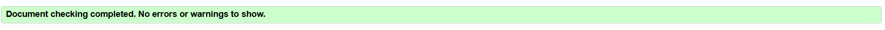

#### View Destination page
 

#### Contact page
 

#### Add Destination page
 

#### SignIn page
 

#### SignOut page
 

#### SignUp page
 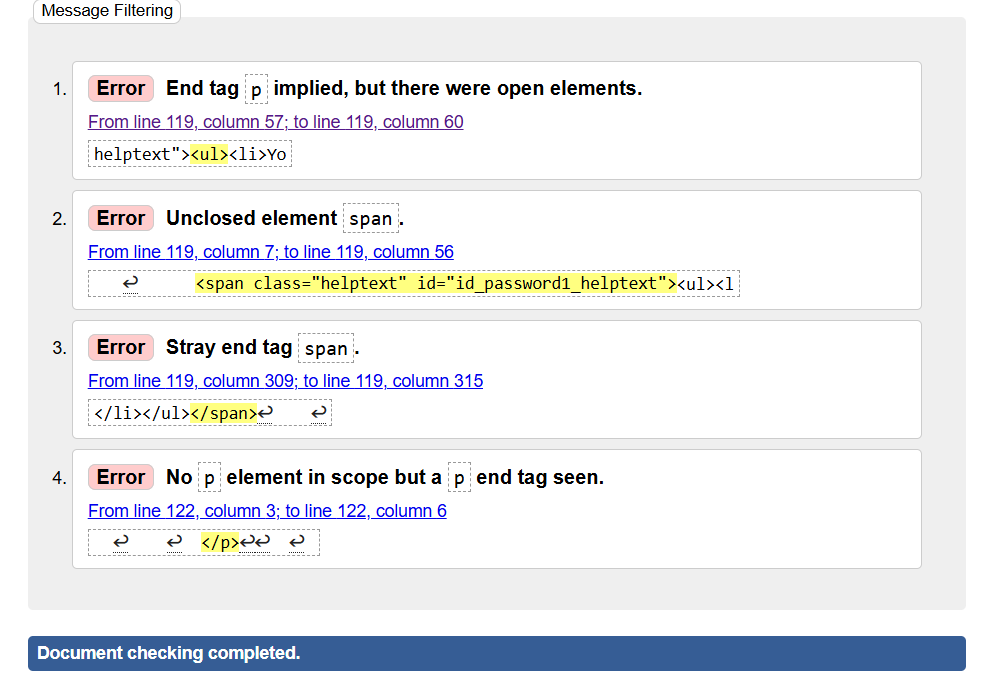
- When I checked the code that the validator was referring to, I looked for it everywhere in an attempt to fix it and then from coding coach channel I got to know that this is being injected form django-allauthit. 

### CSS custom code
- The [W3C CSS Validator](https://jigsaw.w3.org/css-validator/) was used to validate the CSS.
 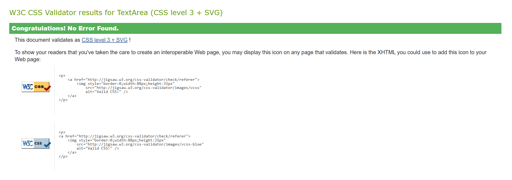

### Python
- The [CI Python Linter](https://pep8ci.herokuapp.com/) was used to validate the Python files.
- admin.py
 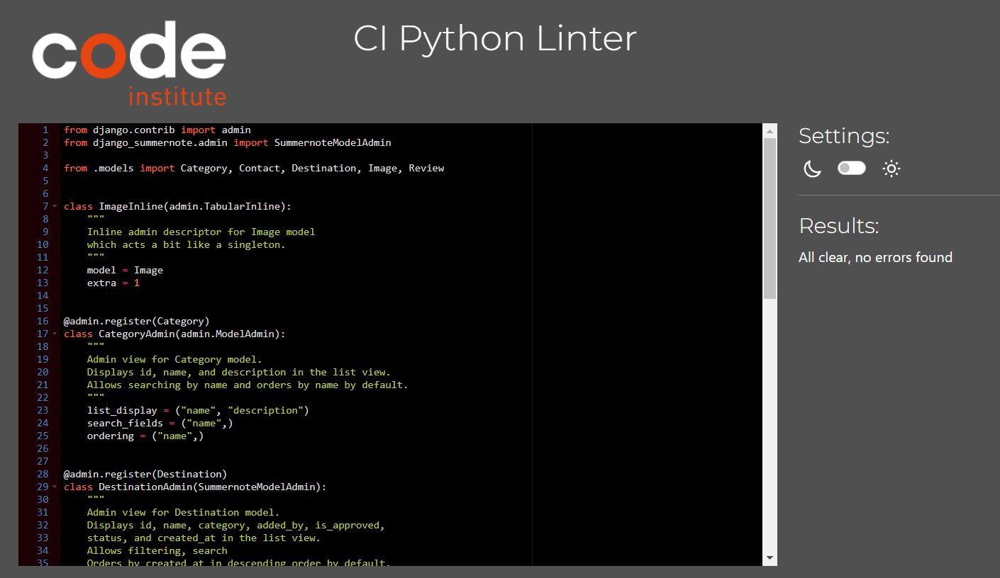
- apps.py
 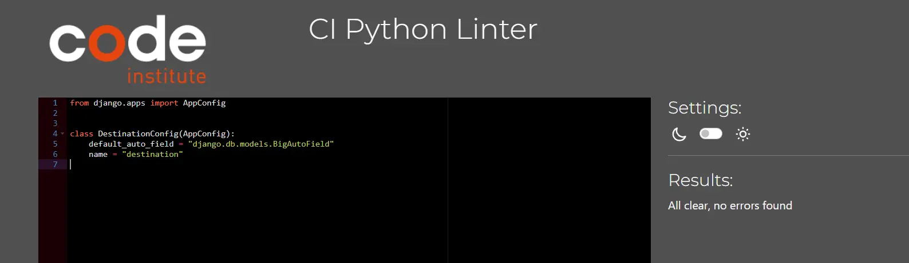
- forms.py
 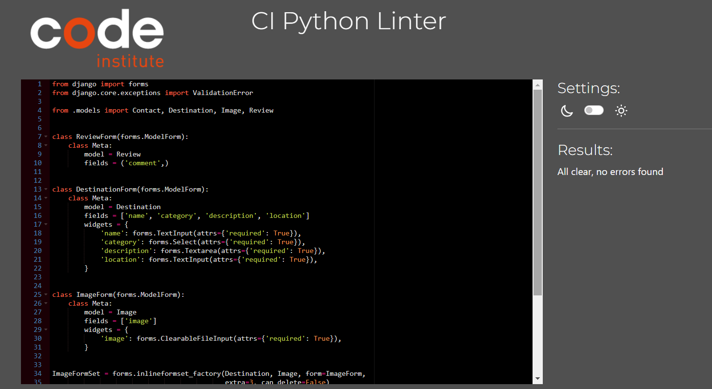
- models.py
 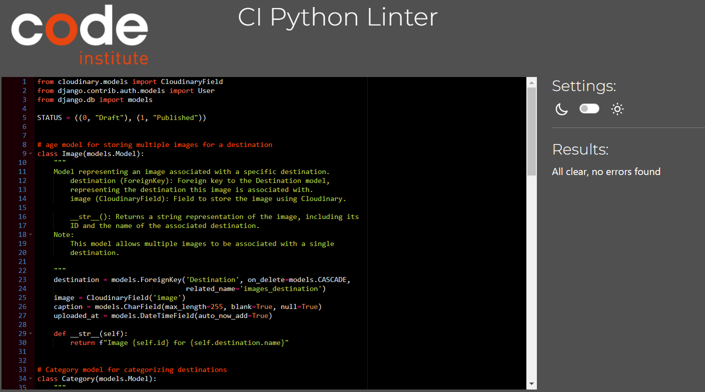
- settings.py
 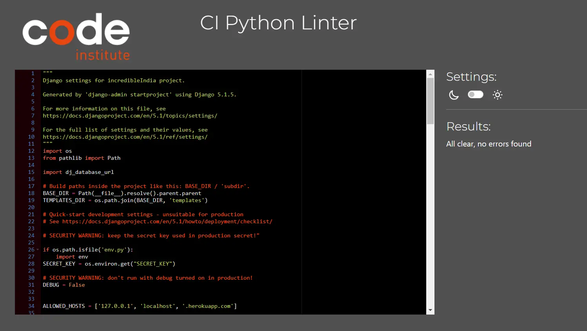
- incredibleIndia/urls.py
 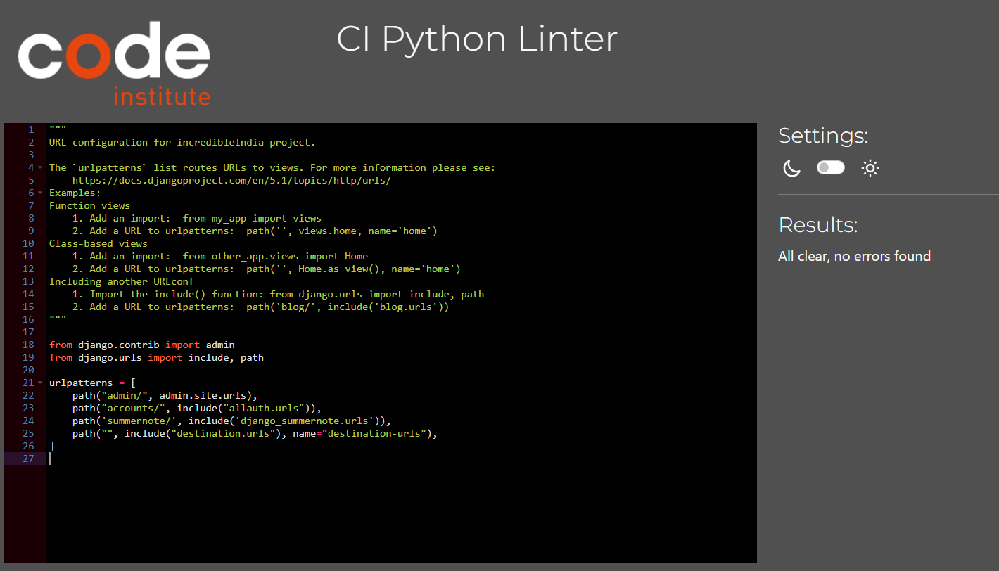
- destination/urls.py
 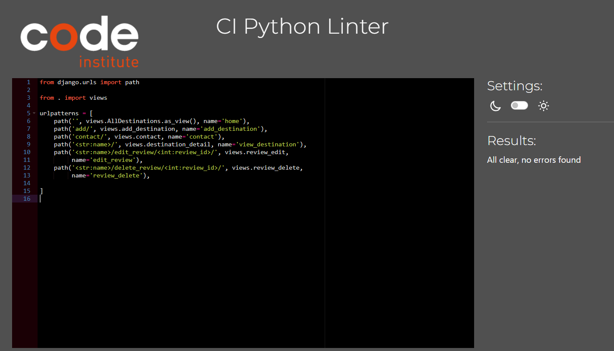
- views.py
 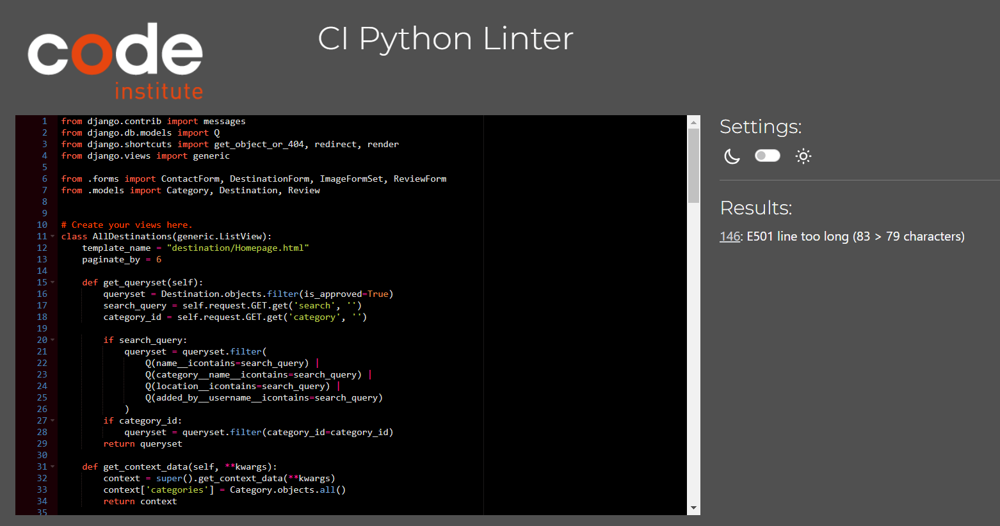
- Even though one line was considered too long by PEP8 (highlighted), I decided that the readability of the code was better when left on the same line, since it was very close to the accepted limit. Even though error exists, the app still functions. 
- wsgi.py
 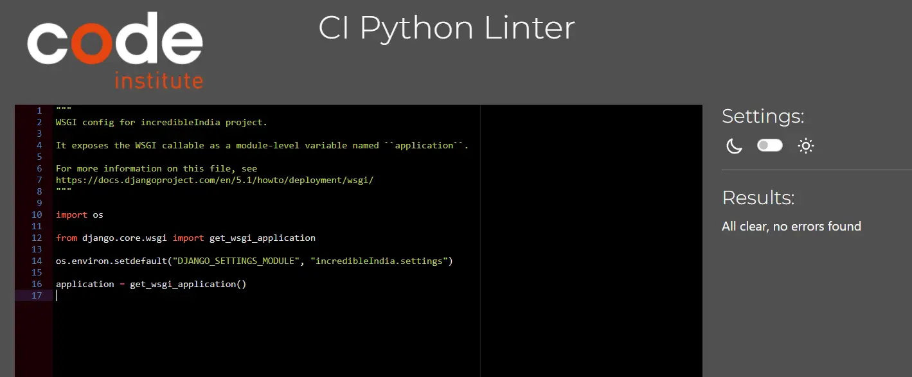

### Lighthouse
#### Home
- Desktop
- 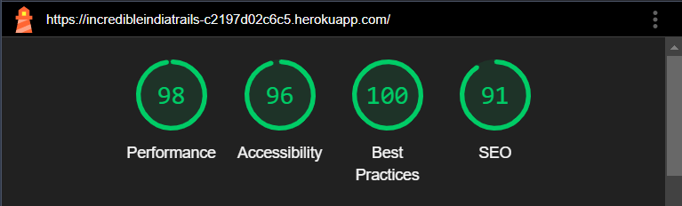
- Mobile
- 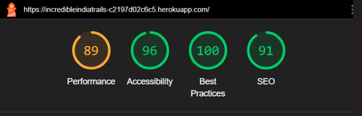

#### View Destination
- Desktop
- 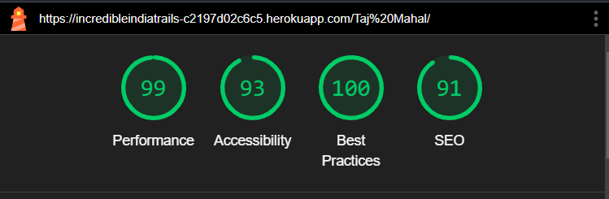
- Mobile
- 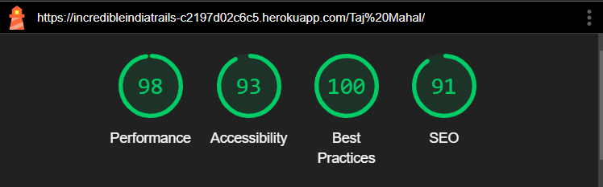

#### Contact
- Desktop
- 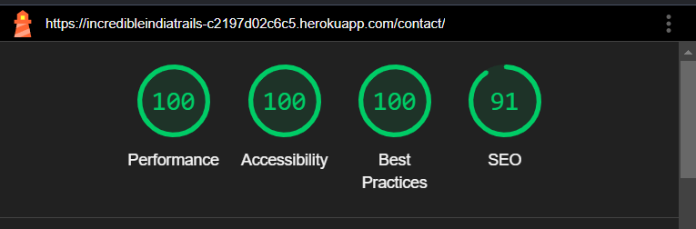

- Mobile
- 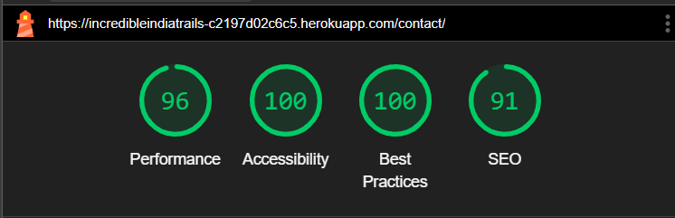

#### Share your find
- Desktop
- 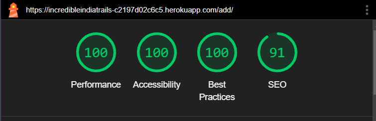

- Mobile
- 

#### Signup
- Desktop
- 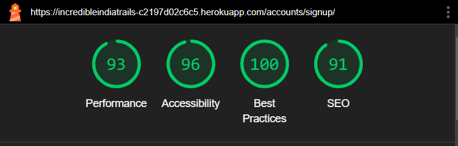

- Mobile
- 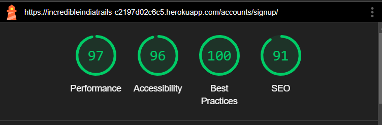

#### Login
- Desktop
- 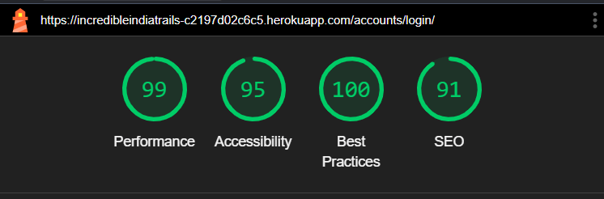

- Mobile
- 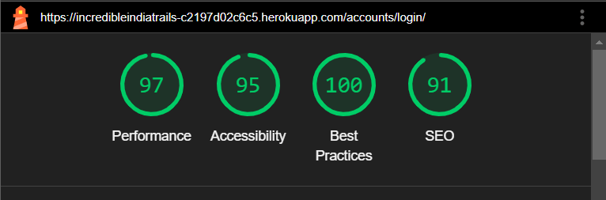

#### Logout
- Desktop
- 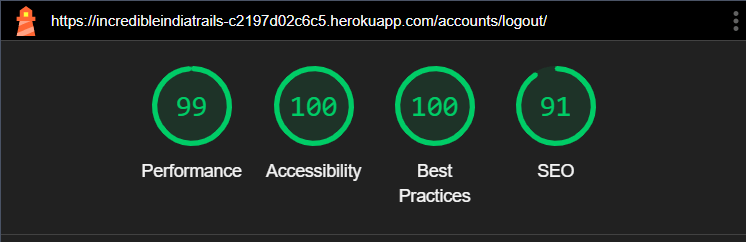

- Mobile
- 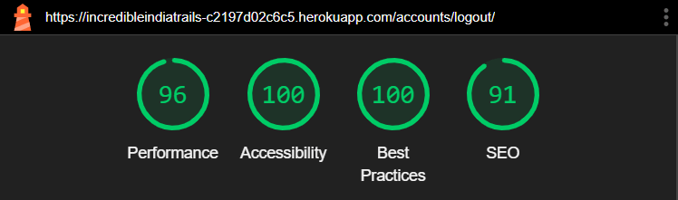

#### Future improvements based on Lighthouse
- On Mobile Screen the performance issue with the home page on mutliple images in were loading and content was detailed. Less destinations should be render on small screen for the future references.
- With view destination page, I solved the performance issue by the use of class collapse so that page loads description of the destination only if user wants to read it. 
- Accessibility could  increase by chosing better colour palette, background in future changes with this project. 

## Responsiveness
- Responsiveness checked on https://ui.dev/amiresponsive after add the extension 'Allow X-Frame-Options' in browser.
- 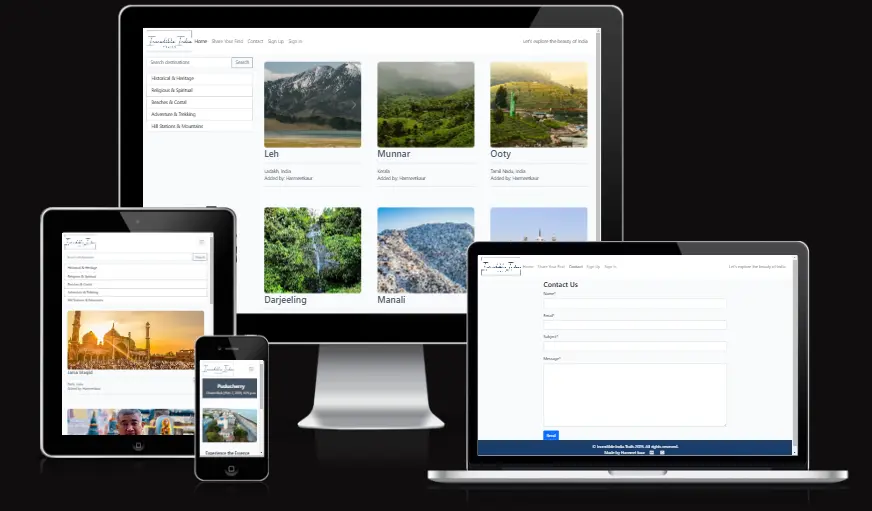
- 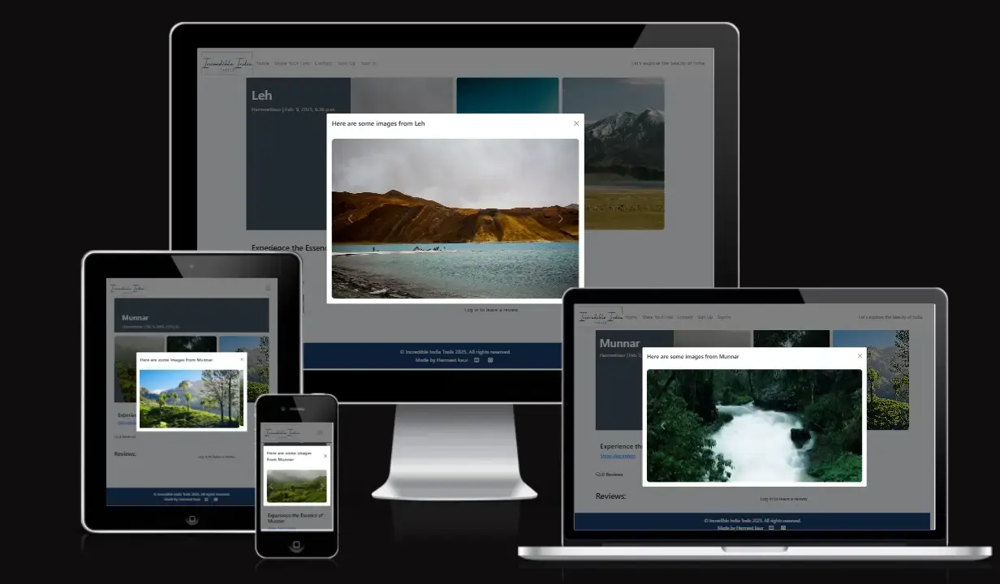

- Responsiveness checked on chrome dev tools.
- 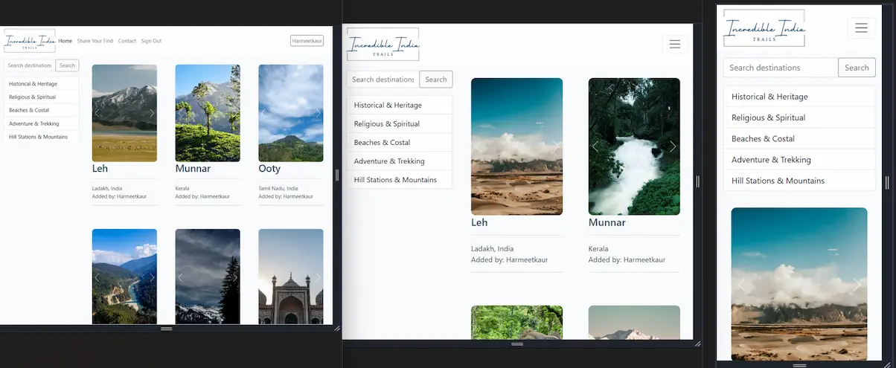

## Bugs
- when user click on image on view destination page the cRousel shows up but the images in it are not shown full because of different dimentions. I tried using contain or cover view but none was perfect for every single image.